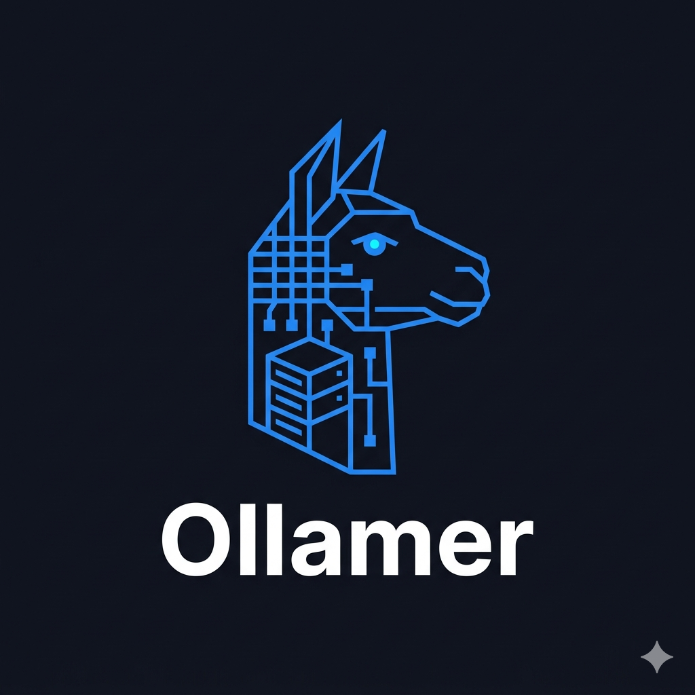

# Ollamer

[](https://github.com/phpclub/ollamer/actions/workflows/rust.yml)
[](https://crates.io/crates/ollamer)
[](https://crates.io/crates/ollamerctl)



Local Ollama model management system: web dashboard + CLI catalog tool.

## Quick start

```bash
# 1. Install both tools
cargo install ollamer
cargo install ollamerctl

# 2. Generate the model catalog (requires Ollama running on localhost:11434)
ollamerctl init

# 3. Check freshness against the registry
ollamerctl update

# 4. Start the web UI
ollamer ~/.ollama/index.json
# → http://0.0.0.0:7777
```

## Components

### [web/](web/README.md) — Web UI

Rust/Axum web server on port 7777. Reads `index.json` and serves a dark-theme dashboard:
- Model cards with architecture, size, capabilities, update status
- Filters by capability, domain, language, update availability
- Sort by name, size, date
- Detail page: system prompt, inference parameters, parent model link
- Pull updates directly from the UI (background download with progress bar)
- Bilingual interface: English / Русский

```bash
cd web && cargo build --release
./target/release/ollamer ~/.ollama/index.json
# → http://0.0.0.0:7777
```

### [ollamerctl/](ollamerctl/README.md) — CLI tool

`ollamerctl` — generates and maintains `index.json` from the Ollama API.

```bash
cd ollamerctl
cargo build --release

# Generate index.json from scratch (after ollama pull):
./target/release/ollamerctl init

# Re-check freshness against registry:
./target/release/ollamerctl update

./target/release/ollamerctl --help
```

## index.json

Shared catalog file. Generated by `ollamerctl init`, updated by `ollamerctl update`.  
Current state: **25 models, 173.94 GB** (as of 2026-05-28).

```jsonc
{
  "generated_at": "...",
  "ollama_host": "http://localhost:11434",
  "total_models": 25,
  "total_size_bytes": 173938529816,
  "total_size_gb": 173.94,
  "freshness_checked_at": "...",
  "models": [ /* see web/README.md for full schema */ ]
}
```

## Typical workflow

```bash
# After pulling new models:
ollama pull qwen3:14b
ollamerctl init
ollamerctl update

# Restart web UI to pick up changes:
ollamer ~/.ollama/index.json
```

## Tech stack

| Component | Language | Key libs |
|---|---|---|
| Web UI | Rust | axum 0.7, tokio, serde_json, libc |
| CLI | Rust | serde_json, curl (subprocess) |
| Frontend | Vanilla HTML/CSS/JS | no build step |
